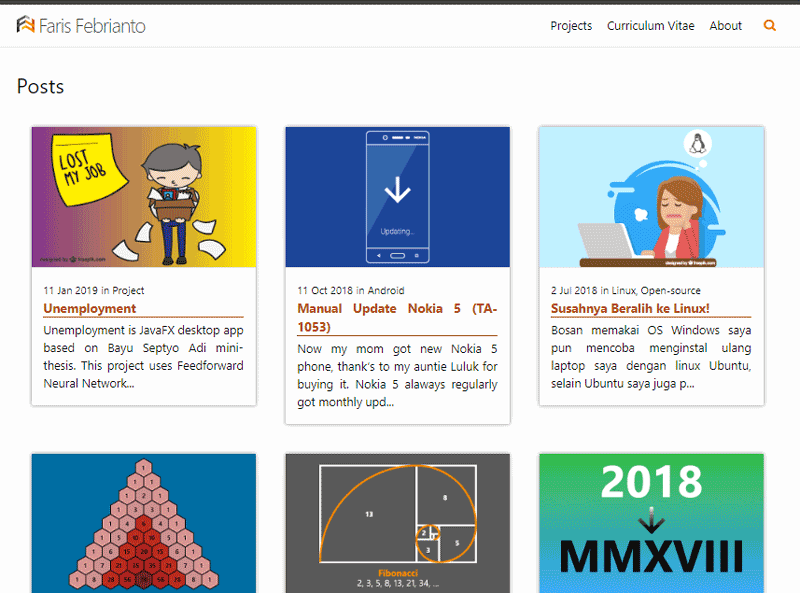

This is [my personal blog](https://farisfebrianto.github.io) made with jekyll based on minima theme. Some feature inspired by blog.webjeda.com and minimal mistakes jekyll themes.

## Key Features

1. 3x3 grid homepage
2. Post excerpt
4. Pagination
5. [Staticman](https://staticman.net) comment
6. Lightweight search using [simple-jekyll-search](https://github.com/christian-fei/Simple-Jekyll-Search)
7. Simplified footer section
8. [Compressed](https://jch.penibelst.de) HTML feature
9. Custom permalink on post
10. Better SEO with jekyll-seo-tag and HTML5 Microdata
11. Alignment utilities

## Screenshot

